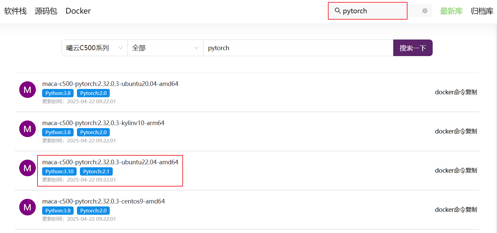
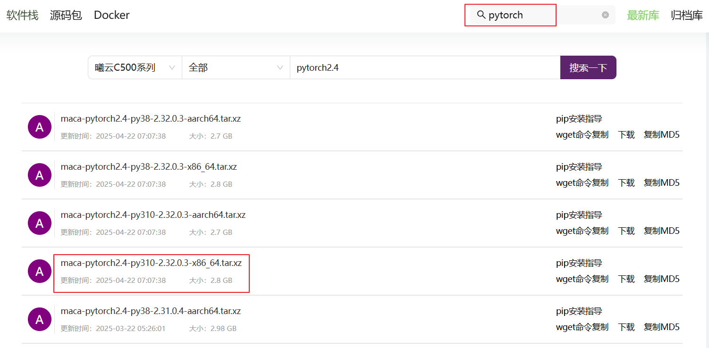
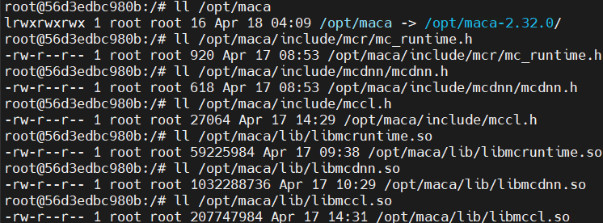
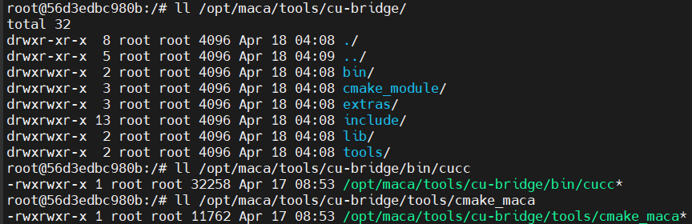
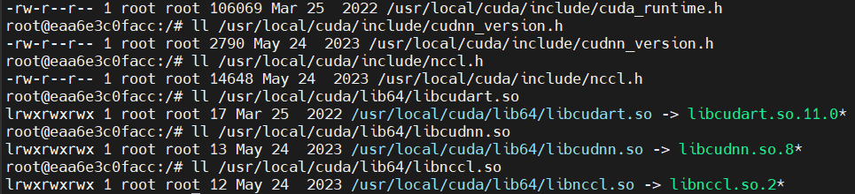
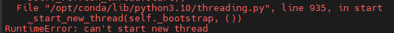
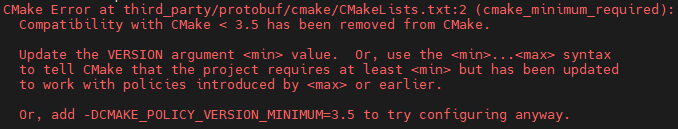

## 0 概述

PyTorch 是一款流行的开源机器学习库，被广泛用于深度学习、自然语言处理、计算机视觉等任务，并已成为许多研究人员和开发人员在人工智能和机器学习领域的首选工具之一。

本工程在 PyTorch 2.4 的基础上增加了对沐曦 (MetaX，https://www.metax-tech.com/) GPU 的支持。MetaX GPU 提供了和 cuda 生态高度兼容的软件栈，包括驱动、编译器以及各类算子库，用户可以使用和 cuda 类似的支持方式完成对 PyTorch 2.4 的 MetaX GPU backend 支持。

## 1 安装

安装前需要首先完成 MetaX 软件栈的环境准备，包括驱动，编译器和算子库，因此推荐直接前往[沐曦开发者社区](https://developer.metax-tech.com/developer/index)下载pytorch 运行镜像，镜像中已经集成了pytorch运行环境。

### 1.1 docker环境

#### 1.1.1 下载镜像
  登录[沐曦开发者社区](https://developer.metax-tech.com/developer/index)，在搜索栏中搜索“pytorch"，找到相关的镜像包，如下图所示。选择 mxc500-torch2.1-py310-mc2.32.0.3-ubuntu22.04-amd64.container.xz 的镜像包并下载。这里以 torch2.1 python310的镜像环境为例，mc2.32.0.3 是 maca 的版本，数字越大表示版本越新，建议尽量选择较新的版本，另外如果有 torch2.4 的镜像可以直接选择 torch2.4 的镜像即可，如果没有 torch2.4 的镜像文件，可以使用相近版本的镜像（比如 torch2.1），然后下载 torch2.4 的安装包安装即可。
  
  


#### 1.1.2 加载镜像
  注意下面的" --device=/dev/dri --device=/dev/mxcd --group-add video"选项，如果没有添加可能无法使用镜像内的maca环境。

``` shell
docker load -i mxc500-torch2.1-py310-mc2.32.0.3-ubuntu22.04-amd64.container.xz
docker run -it --device=/dev/dri --device=/dev/mxcd --group-add video mxc500-torch2.1-py310-mc2.32.0.3-ubuntu22.04-amd64 /bin/bash
```


### 1.2 发布包

  如果已经有对应torch版本的镜像文件，则无需单独下载安装包。如果没有，则可以登录[沐曦开发者社区](https://developer.metax-tech.com/developer/index)，在搜索栏中搜索“pytorch"，找到相关的安装包，如下图所示。2.32.0.3 是 maca 的版本，这里建议选择和运行环境相同的 maca 版本，以免出现兼容性问题。

  

```shell
python -m pip install torch-2.4.0*.whl
```


安装好 mcPytorch 后可以通过以下方式验证安装是否成功。

运行前需要导入必须的环境变量：

```shell
export MACA_PATH=/opt/maca
export LD_LIBRARY_PATH=${MACA_PATH}/lib:${MACA_PATH}/mxgpu_llvm/lib:${MACA_PATH}/ompi/lib:${LD_LIBRARY_PATH}
export MACA_CLANG_PATH=${MACA_PATH}/mxgpu_llvm/bin
```

然后执行：

```shell
python -c "import torch; print(torch.ones(2).cuda())"
```

会得到如下打印输出：

```shell
tensor([1., 1.], device='cuda:0')
```

即表明安装成功。

## 2 源码编译

### 2.1 代码准备

拉取 mcPytorch 代码后需要先同步 submodule。
```shell
git submodule update --init --recursive
```

### 2.2 安装环境

本工程借助 [cuBridge ](https://gitee.com/p4ul/cu-bridge)项目以最小成本完成 MetaX Pytorch 的构建。开始构建前用户需要参考 cuBridge 文档准备好 cuBridge 使用环境 (包括 cuda-toolkit、cudnn 和 nccl， 建议版本 cuda11.6 + cudnn8.5 + nccl 2.12)。

推荐使用 Python3.10 + Ubuntu20.04及以上版本环境构建。另外执行构建脚本时会通过 pip 源拉取安装相关依赖 python 包，请确保当前环境支持该功能。

#### 2.2.1 docker环境（推荐）

参考上面**安装->镜像环境**部分准备镜像环境。

- 检查  maca sdk 环境

  进入容器后，确保 mc_runtime.h/libmcruntime.so、mcdnn.h/libmcdnn.so、mccl.h/libmccl.so 存在。这几个文件分别对应 maca sdk 中运行时库、数学库和通信库，也是 mcPytorch 构建依赖的一部分。



- 检查 cu-bridge 基础环境

  cu-bridge 是 mcPytorch 源码构建中的重要组件，镜像中已经预装了 cu-bridge 基础环境，如下图所示，请确保 /opt/maca/tools/ 下 cu-bridge 目录的存在。



- 安装 CUDA 环境

  mcPytorch 使用 cu-bridge 提供的 cmake 工具链编译功能，需要安装相关 CUDA 环境，即对应 maca sdk 中运行时库、数学库和通信库的 cudatoolkit、cudnn、nccl 库到 /usr/local/cuda/ 目录（不需要安装 CUDA 驱动）。

  相关安装可参考 CUDA 官方文档（todo）。

  安装后检查对应文件是否存在，如下图



- python环境检测

  镜像内自带 python 环境，可以通过一下命令获得版本号信息，确认 python 可用。

    ``` shell
  python --version
    ```


推荐使用 Python3.10 + Ubuntu20.04及以上版本环境构建。另外执行构建脚本时会通过 pip 源拉取安装相关依赖 python 包，请确保当前环境支持该功能。

#### 2.2.2 裸机环境

裸机环境需要先安装好 maca-sdk，然后参考上面的 docker 环境中准备相关环境。

### 2.3 编译

#### 2.3.1   安装必要依赖
```
pip install "cmake<4.0.0"
```
#### 2.3.2   执行

``` shell
cd mcPytorch
bash maca_tools/build_and_run_impl.sh  \
    --maca_path /opt/maca/             \  # 指定安装的 MetaX 软件栈
    --py_setup_cmd bdist_wheel            # 生成安装包，也可以使用 --py_set_cmd install 在构建成功后直接安装 PyTorch 到当前 Python 环境
```

更多选项可以参考：

```shell
bash maca_tools/build_and_run_impl.sh --help
```

进行构建。构建成功结束后，可以在 mcPytorch/dist 目录下找到以 "torch-2.4.0*-linux_x86_64.whl" 的 wheel 包安装文件。


### 常见问题

1. "RuntimeError: can't start new thread..."

   解决方法：参考 https://blog.csdn.net/ZXF_H/article/details/137115521



2. "CMake < 3.5 ..."

   解决方法：较新的 pip 源会默认安装 cmake==4.x 版本，可以使用 pip install "cmake<4.0.0" 进行版本限制。




3. "Could not find any of CMakeLists.txt, ... in ..."

   解决方法：通常是应为依赖的submodule 没有同步成功导致缺少文件报错，需要同步submodule。

   ```
   git submodule update --init --recursive
   ```

   


