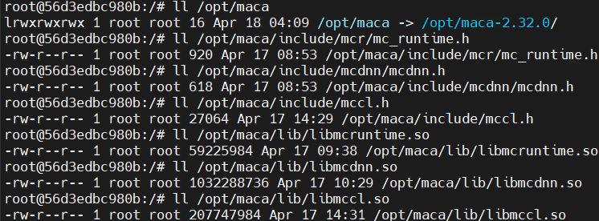
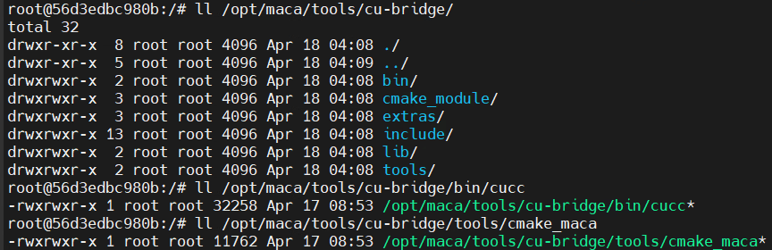

PyTorch 是一款流行的开源机器学习库，被广泛用于深度学习、自然语言处理、计算机视觉等任务，并已成为许多研究人员和开发人员在人工智能和机器学习领域的首选工具之一。

本工程在 PyTorch 2.8.0 的基础上增加了对沐曦 (MetaX，https://www.metax-tech.com/) GPU 的支持。

## 1 获取构建和运行镜像

构建和运行需要首先完成 MetaX 软件栈的环境准备，包括驱动，编译器和算子库，推荐直接前往[沐曦开发者社区](https://developer.metax-tech.com/softnova/docker)下载 pytorch 镜像（例如 maca-pytorch:3.8.0.11-torch2.8-py312-ubuntu24.04-amd64），镜像中已经集成了 MetaX 软件栈基础环境。

加载镜像时请额外指定 "--device=/dev/dri --device=/dev/mxcd --group-add video" 选项，否则在容器内无法使用沐曦 GPU。

## 2 基本环境检查

运行前需要设置环境变量（镜像环境中已设置）：

```shell
export MACA_PATH=/opt/maca
export LD_LIBRARY_PATH=${MACA_PATH}/lib:${MACA_PATH}/mxgpu_llvm/lib:${MACA_PATH}/ompi/lib:${LD_LIBRARY_PATH}
```

然后执行：

```shell
python -c "import torch; print(torch.ones(2).cuda())"
```

会得到如下打印输出：

```shell
tensor([1., 1.], device='cuda:0')
```

表明基本环境检查通过。

## 3 源码编译

### 3.1 代码准备

拉取 mcPytorch 代码后需要先同步 submodule。
```shell
git submodule sync
git submodule update --init --recursive
```

### 3.2 编译环境

本工程借助 [cuBridge ](https://gitee.com/p4ul/cu-bridge)项目以最小成本完成 MetaX Pytorch 的构建，开始构建前用户需要参考 cuBridge 文档准备好 cuBridge 使用环境（镜像环境中已配置）。

推荐使用 Python3.10 + Ubuntu20.04及以上版本环境构建。执行构建脚本时会通过 pip 源拉取安装相关依赖 python 包，请确保网络可用。

#### 3.2.1 镜像环境（推荐）

获取镜像进入容器后：

- 检查  maca sdk 环境

  进入容器后，确保 mc_runtime.h/libmcruntime.so、mcdnn.h/libmcdnn.so、mccl.h/libmccl.so 存在。这几个文件分别对应 maca sdk 中运行时库、数学库和通信库。



- 检查 cu-bridge 基础环境

  cu-bridge 是 mcPytorch 源码构建中的重要组件，镜像中已经预装了 cu-bridge 基础环境，如下图所示，请确保 /opt/maca/tools/ 下 cu-bridge 目录的存在。



- python环境检测

  镜像内自带 python 环境，可以通过一下命令获得版本号信息，确认 python 可用。

    ``` shell
  python --version
    ```

### 3.3 编译

执行

``` shell
cd mcPytorch
bash maca_tools/build_and_run.sh  \
    --maca_path /opt/maca/             \  # 指定安装的 MetaX 软件栈
    --py_setup_cmd bdist_wheel            # 生成安装包，也可以使用 --py_set_cmd install 在构建成功后直接安装 PyTorch 到当前 Python 环境
```

更多选项可以参考：

```shell
bash maca_tools/build_and_run.sh --help
```

进行构建。构建成功结束后，可以在 mcPytorch/dist 目录下找到 wheel 包安装文件。

